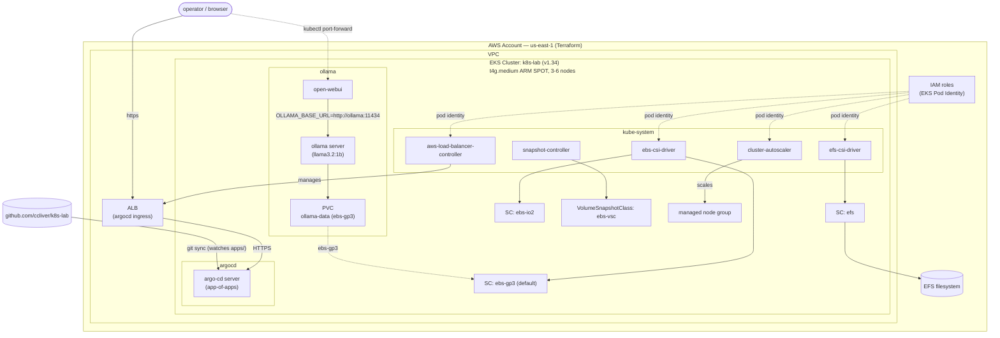

# k8s-lab

A Kubernetes lab on AWS EKS for CKA studying and exploring tools in the Kubernetes ecosystem. Infrastructure is managed with Terraform and a [Taskfile](https://taskfile.dev) runner. GitOps is handled by ArgoCD.

## Architecture



ArgoCD is exposed via a single internet-facing ALB at `/argocd`. ArgoCD watches the `apps/` directory in this repo and uses the [app-of-apps](https://argo-cd.readthedocs.io/en/stable/operator-manual/cluster-bootstrapping/) pattern to sync all managed applications.

## Prerequisites

| Tool | Purpose |
|------|---------|
| [Terraform](https://developer.hashicorp.com/terraform/install) >= 1.0 | Infrastructure provisioning |
| [task](https://taskfile.dev/installation/) | Task runner |
| [AWS CLI](https://docs.aws.amazon.com/cli/latest/userguide/getting-started-install.html) | AWS operations (profile: `lab`) |
| [kubectl](https://kubernetes.io/docs/tasks/tools/) | Cluster interaction |
| [helm](https://helm.sh/docs/intro/install/) | Chart installs |
| [envsubst](https://www.gnu.org/software/gettext/) | Manifest templating |

An AWS profile named `lab` must be configured in `~/.aws/credentials` / `~/.aws/config`.

## Quick Start

```bash
# 1. Deploy everything (Terraform + LBC + ArgoCD + monitoring)
# task deploy first detects your public IP and writes it to terraform/terraform.tfvars
# (endpoint_public_access_cidrs, alb_allowed_cidrs) before applying
task deploy

# 2. Get the ALB URL
task alb-dns
# ArgoCD → http://<alb-dns>/argocd

# 3. Retrieve default passwords
task argocd-password
```

## Available Tasks

```
task deploy                  Deploy lab (Terraform + Helm + ingress)
task destroy                 Tear down lab (order-safe multi-stage)
task set-my-ip               Detect your public IP and write it to terraform/terraform.tfvars
task tf-plan                 Show Terraform plan
task kubeconfig              Add/update cluster in ~/.kube/config
task alb-dns                 Print the ALB DNS name
task argocd-pf               Port-forward ArgoCD UI → http://127.0.0.1:8080
task argocd-password         Retrieve ArgoCD admin password
task open-webui-pf           Port-forward Open WebUI → http://127.0.0.1:8080
```

## Repository Layout

```
.
├── Taskfile.yml              # All day-to-day operations
├── terraform/                # AWS infrastructure (EKS, VPC, IAM, ALB SG)
│   ├── main.tf               # ccliver/k8s-lab/aws module call
│   ├── variables.tf          # endpoint_public_access_cidrs, alb_allowed_cidrs
│   ├── output.tf             # aws_lbc_role_arn, vpc_id, alb_security_group_id, cluster_autoscaler_role_arn
│   ├── backend.tf            # S3 remote state (us-east-1)
│   └── versions.tf           # Terraform >= 1.0, AWS ~> 6
├── manifests/                # Raw K8s manifests (ingresses/StorageClasses applied by Taskfile; others managed by ArgoCD)
│   ├── argocd-ingress.yaml              # ArgoCD ALB ingress (envsubst for SG ID)
│   ├── gp3-storage-class.yaml           # gp3 StorageClass (default, replaces gp2)
│   ├── io2-storage-class.yaml           # io2 StorageClass for high-performance workloads
│   ├── efs-storage-class.yaml           # EFS StorageClass
│   ├── ebs-volume-snapshot-class.yaml   # EBS VolumeSnapshotClass
│   ├── nginx-efs.yaml                   # Nginx deployment on EFS (demo)
│   └── ollama.yaml                      # Ollama server + PVC + Service + Open WebUI (managed by ArgoCD)
└── apps/                     # ArgoCD Application manifests (GitOps)
    ├── root.yaml             # Root app that bootstraps all other apps
    └── ollama.yaml           # Ollama app (ollama namespace)
```

## Bootstrap Sequence

`task deploy` runs the following in order:

1. **set-my-ip** — detects your public IP and writes it to `terraform/terraform.tfvars`
2. **Terraform apply** — provisions EKS cluster, VPC, IAM roles, ALB security group
3. **kubeconfig** — updates `~/.kube/config` for the new cluster
4. **wait-for-nodes** — waits until all nodes are `Ready`
5. **helm-install-lbc** — installs AWS Load Balancer Controller into `kube-system` with pod identity
6. **helm-install-cluster-autoscaler** — installs Cluster Autoscaler into `kube-system` with pod identity
7. **helm-install-argocd** — installs ArgoCD into `argocd` namespace
8. **apply-argocd-ingress** — creates ALB ingress for ArgoCD at `/argocd`
9. **apply-gp3-storage-class** — sets gp3 as default StorageClass (replaces gp2)
10. **apply-io2-storage-class** — applies io2 StorageClass for high-performance workloads
11. **apply-efs-storage-class** — applies EFS StorageClass
12. **install-volume-snapshot-crds** — installs VolumeSnapshot CRDs and snapshot controller
13. **apply-ebs-volume-snapshot-class** — applies EBS VolumeSnapshotClass
14. **bootstrap-argocd** — applies `apps/root.yaml` to kick off GitOps sync

## Tear Down

`task destroy` runs a safe multi-stage teardown to avoid orphaned AWS resources:

1. Delete ArgoCD root app and wait for all app cleanup (up to 5m + 30s)
2. Delete ArgoCD ingress → wait 300s for ALB deregistration
3. Drain all nodes → wait 90s for VPC CNI cleanup → destroy the managed node group
4. `terraform destroy` — removes remaining AWS resources
5. Clean up any orphaned ENIs tagged with the cluster name

## Adding Applications (GitOps)

The `apps/root.yaml` root Application is the only manifest applied manually via `kubectl` (during `task deploy`). It implements the [app of apps](https://argo-cd.readthedocs.io/en/stable/operator-manual/cluster-bootstrapping/) pattern — ArgoCD watches the `apps/` directory and automatically syncs any new `Application` manifests committed there.

To add a new application, commit an ArgoCD `Application` manifest to `apps/` and push — no `kubectl apply` needed. ArgoCD will detect and sync it automatically. The `apps/ollama.yaml` is a working example.

## Infrastructure Module

Terraform uses the [`ccliver/k8s-lab/aws`](https://registry.terraform.io/modules/ccliver/k8s-lab/aws) module (v1.14.1). Remote state is stored in S3 with native S3 lock file support. Backend configuration is kept in a gitignored `terraform/backend.hcl` — copy `terraform/backend.hcl.example` and fill in your own bucket details before deploying.

## Pre-commit Hooks

```bash
pre-commit run --all-files
```

Enforces `terraform fmt`, `terraform validate`, `tflint`, merge-conflict detection, and trailing newlines before every commit.
